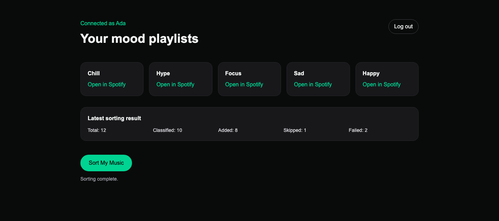
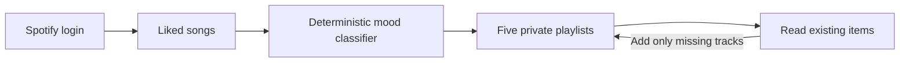

# Mood Sorter

Sort your liked Spotify songs into five stable, private mood playlists without duplicating tracks on repeat runs.



*This dashboard uses representative test data from a successful sort.*

## What it does

| | |
|---|---|
| Five moods | Chill, Hype, Focus, Sad, and Happy |
| Stable sorting | The deterministic `metadata-v1` classifier produces the same result for unchanged track metadata |
| Safe reruns | Existing playlist items are skipped; interrupted runs can be retried |
| Private by default | Only private playlists owned by the connected account are reused |
| Server-side security | Spotify login uses PKCE, and stored tokens are encrypted |

## How it works



<details>
<summary><strong>Run locally</strong></summary>

Requires Node.js 24, pnpm 10, PostgreSQL, and a Spotify Developer application.

```bash
pnpm install
cp .env.example .env.local
openssl rand -hex 32       # SESSION_SECRET
openssl rand -base64 32    # TOKEN_ENCRYPTION_KEY
```

Add those secrets and your Spotify client settings to `.env.local`. Register this redirect URI in Spotify:

```text
http://127.0.0.1:3000/api/auth/spotify/callback
```

Then use a disposable local database and start the app:

```bash
pnpm db:migrate
pnpm dev
```

Open `http://127.0.0.1:3000`. Never use production Spotify credentials or a shared/persistent database for tests.

</details>

## Verify

```bash
pnpm check
```

Integration and browser tests also require a migrated disposable database configured in `DATABASE_URL`:

```bash
pnpm test:integration && pnpm test:e2e
```

Built with Next.js, React, TypeScript, PostgreSQL, Drizzle, Vitest, and Playwright.
