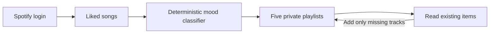

# README Portfolio Refresh Implementation Plan

> **For agentic workers:** REQUIRED SUB-SKILL: Use superpowers:subagent-driven-development (recommended) or superpowers:executing-plans to implement this plan task-by-task. Steps use checkbox (`- [ ]`) syntax for tracking.

**Goal:** Replace the dense root README with a concise portfolio overview featuring an honest dashboard screenshot and a compact workflow graphic.

**Architecture:** Reuse the existing successful-sync Playwright flow as the deterministic source for the dashboard hero, gated behind an explicit environment flag so ordinary test runs do not rewrite tracked assets. Rewrite the README around the product result, one evidence table, one Mermaid flow, and a collapsed local setup section.

**Tech Stack:** Markdown, Mermaid, Next.js 16, React 19, TypeScript, Playwright, PostgreSQL.

## Global Constraints

- Do not change application behavior or visual design.
- Do not use live Spotify data or personal account information.
- Label the screenshot as representative test data.
- Preserve the five private playlists, deterministic `metadata-v1` classification, additive/idempotent synchronization, safe retries, and server-side encrypted token storage claims.
- Keep setup usable but secondary to the portfolio story.
- Keep secret-handling and disposable-database warnings beside the relevant commands.
- Do not add badges, deployment links, or unrelated documentation changes.

---

### Task 1: Produce the dashboard hero from the existing browser flow

**Files:**

- Modify: `tests/e2e/sync-dashboard.spec.ts`
- Modify: `package.json`
- Create: `docs/images/mood-sorter-dashboard.png`

**Interfaces:**

- Consumes: the existing `successfulResult` fixture and authenticated dashboard Playwright test.
- Produces: `pnpm readme:visual`, which writes a deterministic 1440-pixel-wide PNG only when explicitly invoked.

- [ ] **Step 1: Add a failing reproducibility check to the existing successful-sync test**

Add this import at the top of `tests/e2e/sync-dashboard.spec.ts`:

```ts
import { stat } from "node:fs/promises";
```

Before `page.goto("/dashboard")`, select the README viewport only for the visual command:

```ts
if (process.env.UPDATE_README_SCREENSHOT === "1") {
  await page.setViewportSize({ width: 1440, height: 900 });
}
```

After the five successful playlist links are visible, capture and validate the asset:

```ts
if (process.env.UPDATE_README_SCREENSHOT === "1") {
  const screenshotPath = "docs/images/mood-sorter-dashboard.png";
  const screenshot = await page.screenshot({
    animations: "disabled",
    fullPage: true,
    path: screenshotPath,
  });
  expect(screenshot.byteLength).toBeGreaterThan(20_000);
  expect((await stat(screenshotPath)).size).toBe(screenshot.byteLength);
}
```

- [ ] **Step 2: Add the visual-generation command**

Add this script to `package.json` beside `test:e2e`:

```json
"readme:visual": "UPDATE_README_SCREENSHOT=1 playwright test tests/e2e/sync-dashboard.spec.ts --grep 'authenticated dashboard announces pending work' --workers=1"
```

- [ ] **Step 3: Run the visual command before the image exists**

Run with the same disposable PostgreSQL and inert server environment used by the browser suite:

```bash
pnpm readme:visual
```

Expected: the targeted Playwright test passes and creates
`docs/images/mood-sorter-dashboard.png`. If Chromium is missing, run
`pnpm exec playwright install chromium` once and rerun.

- [ ] **Step 4: Inspect the generated hero**

Open `docs/images/mood-sorter-dashboard.png` and confirm:

- the title is `Your mood playlists`;
- the account name is the fixture value `Ada`;
- Chill, Hype, Focus, Sad, and Happy are visible;
- the successful counts and five `Open in Spotify` links are visible;
- no live user name, avatar, track name, token, or credential appears;
- text is legible at a GitHub README width.

- [ ] **Step 5: Prove the ordinary browser test still passes without rewriting the asset**

Record the asset hash, run the targeted test without the update flag, and compare hashes:

```bash
shasum -a 256 docs/images/mood-sorter-dashboard.png
pnpm exec playwright test tests/e2e/sync-dashboard.spec.ts --grep "authenticated dashboard announces pending work" --workers=1
shasum -a 256 docs/images/mood-sorter-dashboard.png
```

Expected: the test passes and both hashes match.

- [ ] **Step 6: Commit the reproducible visual**

```bash
git add package.json tests/e2e/sync-dashboard.spec.ts docs/images/mood-sorter-dashboard.png
git commit -m "docs: add reproducible dashboard hero"
```

---

### Task 2: Replace the README with the portfolio-first story

**Files:**

- Modify: `README.md`

**Interfaces:**

- Consumes: `docs/images/mood-sorter-dashboard.png` from Task 1 and the existing `.env.example`, migration, development, and test commands.
- Produces: a short GitHub-renderable root README with one raster hero and one Mermaid workflow graphic.

- [ ] **Step 1: Replace the README with the approved concise content**

Use this complete structure and copy, adjusting only line wrapping if required by Markdown rendering:

````markdown
# Mood Sorter

Sort your liked Spotify songs into five stable, private mood playlists—without duplicating tracks on repeat runs.


*The dashboard shown with representative test data after a successful sort.*

## What it does

| | |
|---|---|
| Five moods | Chill, Hype, Focus, Sad, and Happy |
| Stable sorting | A deterministic `metadata-v1` classifier gives the same track metadata the same result |
| Safe reruns | Existing playlist items are skipped; interrupted runs can be retried |
| Private by default | Only private playlists owned by the connected account are reused |
| Server-side security | Spotify login uses PKCE, and stored tokens are encrypted |

## How it works



<details>
<summary><strong>Run locally</strong></summary>

Requires Node.js 24, pnpm 10, PostgreSQL, and a Spotify Developer application.

```bash
pnpm install
cp .env.example .env.local
openssl rand -hex 32       # SESSION_SECRET
openssl rand -base64 32    # TOKEN_ENCRYPTION_KEY
```

Add those secrets and your Spotify client settings to `.env.local`. Register this redirect URI in Spotify:

```text
http://127.0.0.1:3000/api/auth/spotify/callback
```

Then use a disposable local database and start the app:

```bash
pnpm db:migrate
pnpm dev
```

Open `http://127.0.0.1:3000`. Never use production Spotify credentials or a shared/persistent database for tests.

</details>

## Verify

```bash
pnpm check
```

Integration and browser tests additionally require the migrated disposable database configured in `DATABASE_URL`:

```bash
pnpm test:integration && pnpm test:e2e
```

Built with Next.js, React, TypeScript, PostgreSQL, Drizzle, Vitest, and Playwright.
````

- [ ] **Step 2: Validate local links and image references**

Run:

```bash
node --input-type=module -e '
import fs from "node:fs";
import path from "node:path";
const readme = fs.readFileSync("README.md", "utf8");
const links = [...readme.matchAll(/!?\[[^\]]*\]\((?!https?:|#)([^)]+)\)/g)].map((match) => match[1]);
const missing = links.filter((link) => !fs.existsSync(path.resolve(link)));
if (missing.length) { console.error(missing.join("\n")); process.exit(1); }
console.log(`Resolved ${links.length} local README reference(s).`);
'
```

Expected: `Resolved 1 local README reference(s).`

- [ ] **Step 3: Validate the Mermaid source and Markdown hygiene**

Run:

```bash
rg -n '^```mermaid$|^flowchart LR$|Add only missing tracks' README.md
git diff --check
```

Expected: one Mermaid fence, one `flowchart LR`, the repeat-run label, and no
`git diff --check` output.

- [ ] **Step 4: Review the final README for brevity and accuracy**

Confirm:

- the title, pitch, and screenshot appear before implementation details;
- only the setup disclosure contains more than one paragraph of operational detail;
- the feature table preserves every material claim in the design spec;
- the screenshot caption identifies representative test data;
- the Mermaid diagram fits a left-to-right GitHub layout;
- no statement promises live deployment, perfect classification, or rollback of partial Spotify writes.

- [ ] **Step 5: Run focused and repository verification**

Run:

```bash
pnpm exec playwright test tests/e2e/sync-dashboard.spec.ts --grep "authenticated dashboard announces pending work" --workers=1
pnpm lint
pnpm typecheck
pnpm test
git diff --check
```

Expected: every command exits 0. The database-backed Playwright command uses
the same disposable environment as Task 1.

- [ ] **Step 6: Commit the README refresh**

```bash
git add README.md
git commit -m "docs: streamline project readme"
```

---

### Task 3: Final visual and repository audit

**Files:**

- Modify only if verification reveals a defect.

**Interfaces:**

- Consumes: the committed dashboard hero and README.
- Produces: evidence that the visual, documentation, and normal test path agree.

- [ ] **Step 1: Regenerate the image once from its source flow**

```bash
pnpm readme:visual
git diff --exit-code -- docs/images/mood-sorter-dashboard.png
```

Expected: the visual test passes and regeneration does not change the committed
PNG.

- [ ] **Step 2: Run the project verification command**

```bash
pnpm check
```

Expected: lint, type checking, unit tests, and the production build all pass.

- [ ] **Step 3: Inspect final repository state**

```bash
git status --short
git log -3 --oneline
```

Expected: no uncommitted files and commits for the design, dashboard hero, and
README refresh are visible.
